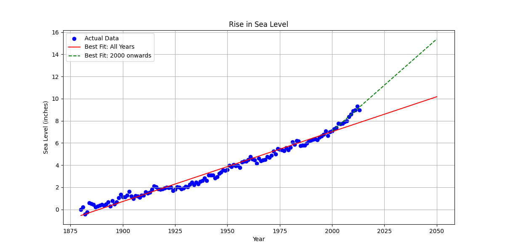

# 🌊 Sea Level Predictor

---

## 📖 Project Overview

This project analyzes historical global sea level data from 1880 to 2014 to understand long-term trends and predict future sea level rise through the year 2050. Using **linear regression**, it fits two lines of best fit:

- One spanning **all available years (1880–2014)**
- One focused on the **more recent data from 2000 onward**

These models provide insights into how sea levels have changed over time and project future increases under different trends.

---

## 📊 Dataset

- Source: U.S. Environmental Protection Agency (EPA) and CSIRO (Commonwealth Scientific and Industrial Research Organisation)
- File: `epa-sea-level.csv`
- Timeframe: 1880 to 2014
- Features:
  - **Year**: Calendar year of observation
  - **CSIRO Adjusted Sea Level**: Measured sea level in inches, adjusted for various factors

---

## 🔍 Visualizations

### Scatter Plot with Regression Lines

- **Blue dots:** Actual measured sea level data points  
- **Red line:** Linear trend from 1880 to 2014 projected through 2050  
- **Green dashed line:** Linear trend from 2000 to 2014 projected through 2050

---

## 🧠 Key Insights

- The sea level has been rising steadily since 1880, with an overall upward trend clearly visible.  
- The trend line fit from 2000 onward indicates a possibly accelerated rate of rise in recent years.  
- Projecting these trends forward shows a significant increase in sea levels by 2050, which underscores the urgency of addressing climate change impacts.

---

## ✅ Technologies & Skills Demonstrated

- Data cleaning and preprocessing with **Pandas**  
- Scatter plotting and regression line plotting with **Matplotlib**  
- Statistical modeling using **linear regression** via `scipy.stats.linregress`  
- Interpretation of time series and trend analysis  

---

## ⚙️ How to Run

1. Clone or download this repository.  
2. Ensure you have Python 3 and necessary libraries (`pandas`, `matplotlib`, `scipy`).  
3. Run the provided Python script or notebook to generate the visualizations and predictions.  

---

## 📬 Contact

- 📧 Email: oluwatoyin.eniitan2020@gmail.com  
- 🔗 LinkedIn: [https://www.linkedin.com/in/eniitan-oluwatoyin-93ab9022b/](https://www.linkedin.com/in/eniitan-oluwatoyin-93ab9022b/)  
- 🧠 GitHub: [https://github.com/GRACEDOFGOD](https://github.com/GRACEDOFGOD)

---

## 📝 Conclusion & Recommendation

The sea level rise projections indicate a continuing and possibly accelerating increase in ocean levels, posing risks to coastal communities worldwide. These findings emphasize the need for:

- Continued monitoring and modeling of sea level changes  
- Implementing mitigation strategies to reduce greenhouse gas emissions  
- Preparing adaptation measures for vulnerable areas  

This project illustrates the power of combining historical data with statistical modeling to inform climate science and policy.

---

> Feel free to explore, reuse, and build upon this project for your own data science journey!
